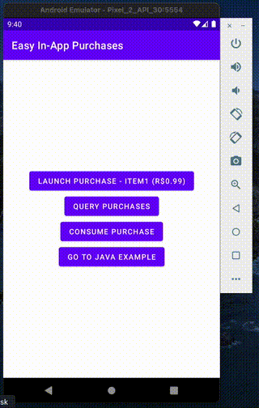

*The Google-developed Android [In App Purchases](https://developer.android.com/google/play/billing/integrate) library can seem quite confusing and too much code to do something as simple as making in-app purchases via Google Play. Whenever I needed to implement this in a new application, I wasted a lot of time reading their documentation with a lot of verbose code. So some time ago I had developed this library which makes this task much simpler and now I'm updating it and making it public for everyone. Any help is welcome! :D*

  
[MainActivityJava.java and MainActivityKotlin.kt examples here.](app/src/main/java/com/maickonn/easyinapppurchasesexample)

**Download the demo**  
<a href="https://play.google.com/store/apps/details?id=com.maickonn.easyinapppurchasesexample" target="_blank"></a>


## Dependencies
**Step 1.** Add the JitPack repository to your root build.gradle at the end of repositories:
```css
allprojects {
	repositories {
		...
		maven { url 'https://jitpack.io' }
	}
}
```

**Step 2.** Add the dependencies
```css
dependencies {
	implementation 'com.github.maickonn:EasyInAppPurchases:1.0.0'
	implementation 'com.android.billingclient:billing:3.0.3'
}
```

## Usage:
```kotlin
import com.maickonn.EasyInAppPurchases
import com.android.billingclient.api.Purchase
import com.android.billingclient.api.SkuDetails
import com.android.billingclient.api.BillingResult


val skuList: ArrayList<String> = ArrayList()  
skuList.add("item1")  
skuList.add("item2")  
skuList.add("item3")
skuList.add("subs1")  
skuList.add("subs2")  
skuList.add("subs3")

val easyInAppPurchases =  EasyInAppPurchases(this, skuList, object : EasyInAppPurchases.EasyInAppPurchasesCallback {  
    override fun onProductPurchased(purchase: Purchase) {
	if (purchase.purchaseState != Purchase.PurchaseState.PURCHASED)
	    return

	// TODO: Add your purchase control here
    }

    override fun onGetProductDetails(skuDetails: SkuDetails) {
	// SkuDetails usage example
	val price = skuDetails.price
	val sku = skuDetails.sku
    }

    override fun onProductRestored(purchase: Purchase) {
	// Example of use when you have an active purchase
	if (purchase.sku == "item1")
	    supportActionBar?.title = "Easy In-App Purchases (Premium)"
    }

    override fun onConsumeResponse(billingResult: BillingResult, purchaseToken: String) {

    }
})
```

## How to test
 1. First, you need to submit your app to Google Play Console with the
    dependencies of that library. We recommend that you submit your app
    as **Closed Alpha** for testing.
 2. After submitting your app to the Google Play Console with
    dependencies from that library, the **Products in App** option must
    be enabled in your app's **Products** section in the Google Play
    Console.
 3. Go to **Products in App** option in the Google Play Console and
    add some products, remember that the SKUs must have the same name as
    the ones you entered in your app codes.
 4. Now go back to your Google Play Console home screen, go to the
    **Settings** section, then go to **License Tests**. On this screen, you'll add the emails that will be used as part of testing in-app
    purchases.
 5. Wait a few hours for the changes to take effect on Google's servers
    and then you'll be able to test all in-app purchase commands.

*Please note: If you try to use in-app purchase commands without submitting your app to the store, nothing will work, no error messages or warnings will be displayed. Simply nothing will happen. [You can find more details about this at this link.](https://developer.android.com/google/play/billing/test)*


## Documentation
**Public constructors**
``` kotlin
EasyInAppPurchases (
	activity: Activity,
	skuList: List<String>,
	easyInAppPurchasesCallback: EasyInAppPurchasesCallback?
)
```

| Public methods               | Return types | Callbacks          |
|------------------------------|--------------|--------------------|
| queryPurchases()             | void         | onProductRestored  |
| launchPurchase(sku: String)  | void         | onProductPurchased |
| consumePurchase(sku: String) | void         | onConsumeResponse  |

